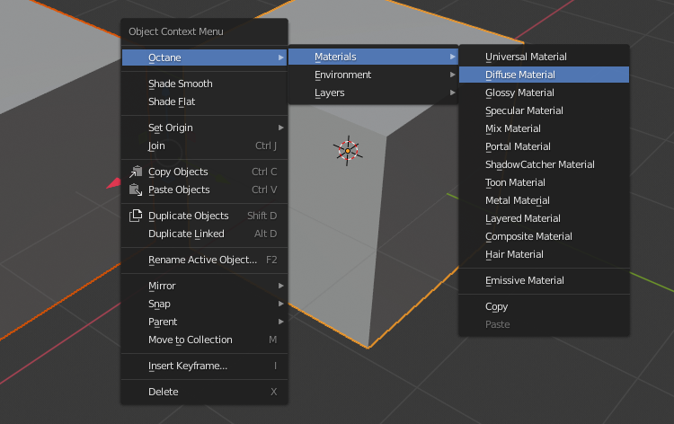
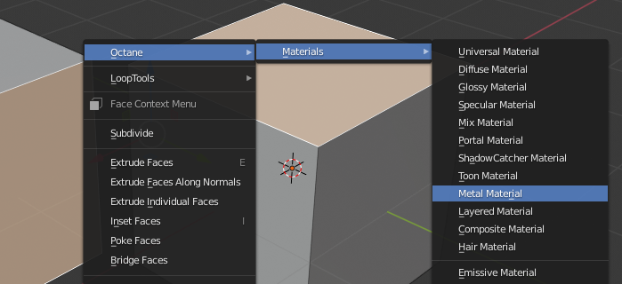
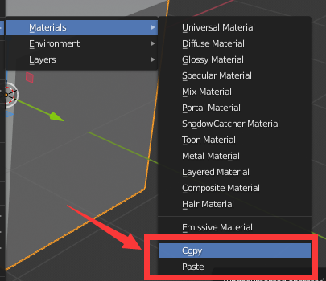
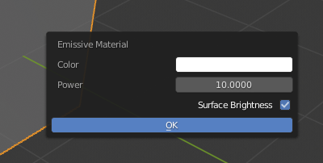
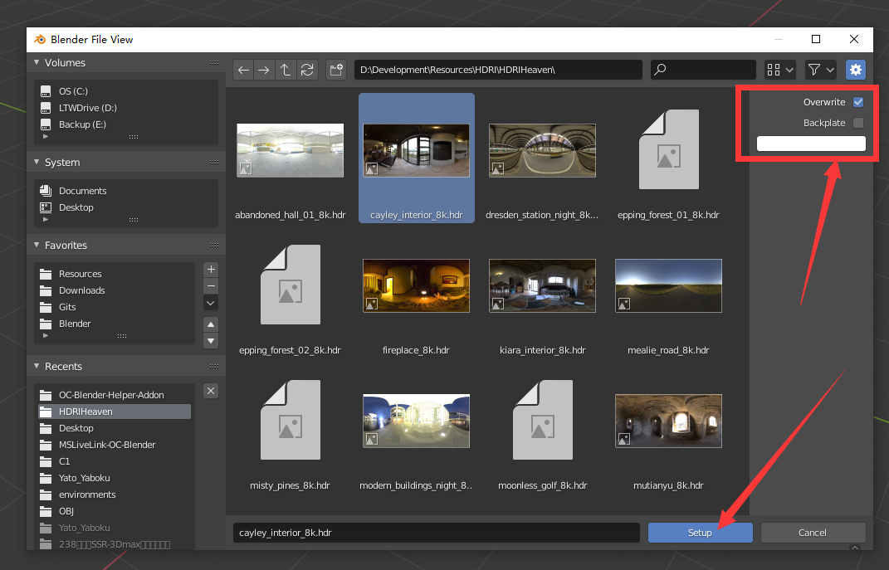

# OC-Blender-Helper-Addon
A helper addon for Octane Blender edition

## Versions

* OctaneRender™ for Blender 2019 and later
* Current version **v1.1.0**
  * Tested on Blender_Octane_Edition_2020.1.RC3_21.5_beta (latest)

## Features

* In the object mode, we can assign octane materials to all selected objects

  

* In the edit mode, we can assign octane materials to all selected faces of selected objects

  * If an object has no base material, it will create one

  

* In either object or edit mode, we can copy an active material from one object, and paste it to all selected objects

  

* Supports emissive material

  

  

* Setup the texture environment in one click

  * Overwrite option
    * Modifies Blender display device settings to get a correct response
    * Set hdr image's gamma to 1.0
    * Overwrites settings of Octane Camera Imager
    * Adds a 3D transform node to the environment texture
  * Backplate and backplate color option
    * Replace visible environment with a RGB color

  

  

* Set specific render layer id to all selected objects

  

  

## Installation

* Preferences > Add-ons > Install
* Select Octane_Helper.zip to install
* Activate it

## How to use

* Pretty simple, just **right click** in the 3D viewport
* Make sure the Octane render is enabled, otherwise the menu will not show up
* It works in either object mode or edit mode, but provides different functions

## WIP

* Toggle clay mode rendering
* Menu to create octane-related objects 
  * e.g. Directional light, backdrops