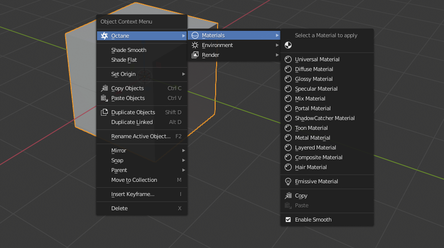
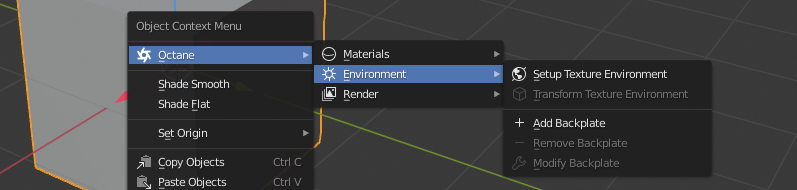
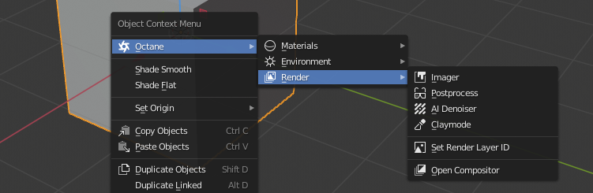

# OC-Blender-Helper-Addon
A helper addon for Octane Blender edition

## Versions

* OctaneRender™ for Blender 2019 and later
* Current version **v1.5.0**
  * Tested on Blender_Octane_Edition_2020.1.RC3_21.5_beta (latest)

## Features

* In either Object or Edit mode, we can assign materials to all selected objects/faces
* If no base material found in edit mode, create one
  * Option 'Enable smooth' will ensure all materials created are smoothed out or not
* We can search a material and assign it to all selected objects or faces
* We can copy an active material from an object/face and paste it to all other selected objects/faces
* Support emissive material
* Setup texture environment in one click

  * Overwrite option
    * Modifies Blender display device settings to get a correct response
    * Set hdri image's gamma to 1.0
    * Overwrites settings of Octane Camera Imager
    * Adds a 3D transform node to the environment texture
  * Backplate and backplate color option
    * Replace visible environment with a RGB color
* Transform existing texture environment dynamically

  * Make sure you have a 3D transform node connected to the graph
* Support changing the backplate
* Support basic render settings for quick access
* Set specific render layer id to all selected objects
* Support color and uv grid materials

## Installation

* Preferences > Add-ons > Install
* Select Octane_Helper.zip to install
* Activate it

## How to use

* Pretty simple, just **right click** in the 3D viewport
* Make sure the Octane render is enabled, otherwise the menu will not show up
* It works in either object mode or edit mode, but provides different functions

## WIP

* UV grid and Color grid material
* PBR Material
* SSS Material
* Medium environment
* Menu to create octane-related objects 
  * e.g. Directional light, backdrops