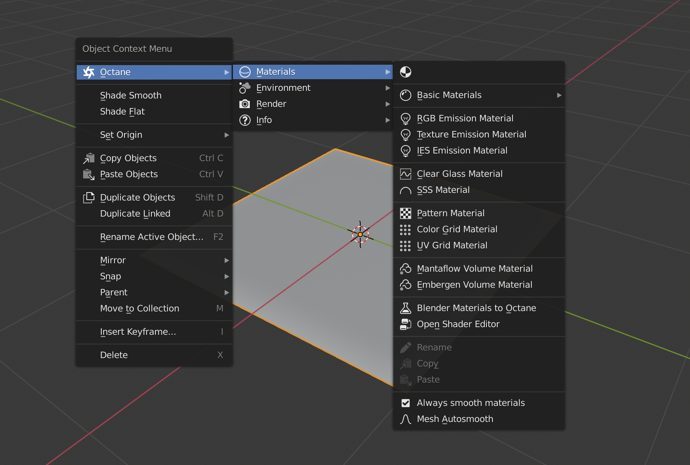
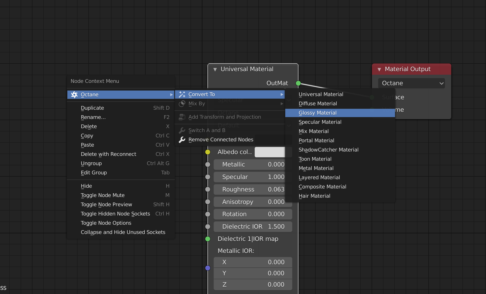

OC-Blender-Helper-Addon

A helper addon for Octane Blender edition

> The reason I develop this addon is for speeding up user workflow, so users can access basic functions provided by Octane very quickly and newcomers can know where to start. The materials and nodes setup are pretty raw and treat it as a starting point

> I welcome issue reports, please let me know where to promote and fix

> Glhf

## Versions

* OctaneRender™ for Blender 2020 and later
* Current version **v2.4.0**
  * Tested on Blender_Octane_Edition_2020.1_21.8 (latest)

## Downloads

* Go to [Releases](https://github.com/Yichen-Dou/OC-Blender-Helper-Addon/releases)

* Download the newest **Octane_Helper.zip**

## Features

* You can find them by yourself

## Installation

* Preferences > Add-ons > Install
* Select **Octane_Helper.zip** to install
  * Please do not install the zip from the downloaded repository named OC-Blender-Helper-Addon-master.zip
* Activate it
  * If you have installed the addon, please restart your Blender

## How to use

* Pretty simple, just **Right Click** in the **3D viewport** or **Nodes Editor (Object)**
* Make sure the **Octane render is enabled**, otherwise the menu will not show up
* It works in object mode, edit mode and nodes editor, but provides different functions

## Issues

* We cannot insert keyframes and click file selector eyedropper from panels yet because of a known bug in Blender build, which will be fixed in future builds

## WIP

* Bake
