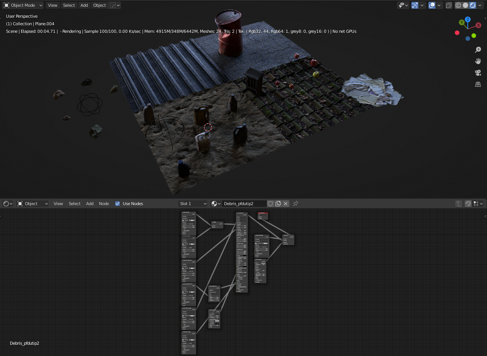
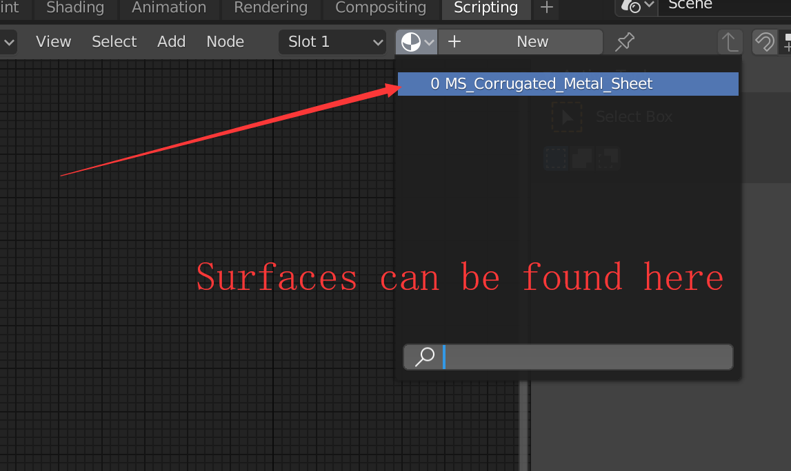

# OC-Blender-Helper-Addon

A helper addon for Octane Blender edition

> The reason I develop this addon is for speeding up user workflow, so users can access basic functions provided by Octane very quickly and newcomers can know where to start. The materials and their nodes setup are pretty rough and use them as a starting point

> I welcome issue reports, please let me know where to promote and fix

> Glhf

## Versions

* **OctaneRender™ for Blender 2020 and later**
* Current version **v2.7.3**
  * Tested on **Blender_Octane_Edition_2020.1_21.8** (latest)
  * **Megascans Livelink Module** is included since **v2.6.0**
    * [Archived Git Project](https://github.com/Yichen-Dou/MSLiveLink-OC-Blender)

## Downloads

* Go to [Releases](https://github.com/Yichen-Dou/OC-Blender-Helper-Addon/releases)

* Download the newest **Octane_Helper.zip**

## Features

**Right-Click Menu**

* Make sure the **Octane render is enabled**, otherwise the menu will not show up
* It works in object mode, edit mode and nodes editor, but provides different functions

**Megascans Livelink Module**

* Make sure the **Octane render is enabled**, otherwise it declines to import the asset
* It starts automatically when you open the Octane Blender
* There is no UI button to activate it
* Make sure you do not have the **Official Livelink Addon** installed. Otherwise, this module will keep silent with imports
* The imported surface material can be found in Material Slots to be assigned manually
  * You can also use Right-Click menu > Materials > Paste to paste the surface material

**Minimum textures to get a correct response for Megascans Livelink**

**Supported Textures for Megascans Livelink**

| Textures         | Info                             |
| ---------------- | -------------------------------- |
| **Albedo**       | Added by default (If exists)     |
| **Displacement** | Added by default (If exists)     |
| **Normal**       | Added by default (If exists)     |
| **Roughness**    | Added by default (If exists)     |
| **Specular**     | Added by default (If exists)     |
| Opacity          | Added by default (If exists)     |
| Translucency     | Added by default (If exists)     |
| Metalness        | Added by default (If exists)     |
| AO               | Added by default (If exists)     |
| Bump             | Optional (Toggle in preferences) |
| Fuzz             | Optional (Toggle in preferences) |
| Cavity           | Optional (Toggle in preferences) |
| Curvature        | Optional (Toggle in preferences) |

## Installation

* Preferences > Add-ons > Install
* Select **Octane_Helper.zip** to install
  * Please do not install the zip from the downloaded repository named OC-Blender-Helper-Addon-master.zip
* Activate it
  * If you have installed the addon, please restart your Blender

## Questions

* Cannot insert keyframes from UI panels
  * We cannot insert keyframes and click file selector eyedropper from panels yet because of a known bug in Blender build, which will be fixed in future builds
* Megascans Livelink module does not respond to imports
  * Check the log to see the error
  * Starting from 2020, when you first time launch the Bridge App and click the "Download Plugin", it automatically puts an addon that occupies the port at startup into C:\Users\\[Your username]\AppData\Roaming\Blender Foundation\Blender\2.8[X]\scripts\startup. It's called "MSPlugin", please remove the folder and restart the Blender
  * There is no switch button for the official quixel addon, so if you want to use the addon for cycles/eevee again, just simply reinstall the offical addon then the octane megascans module will keep silent
* Other issues
  * Please check the log from Blender > Top Bar > Window > Toggle System Console and let me know what's happening
