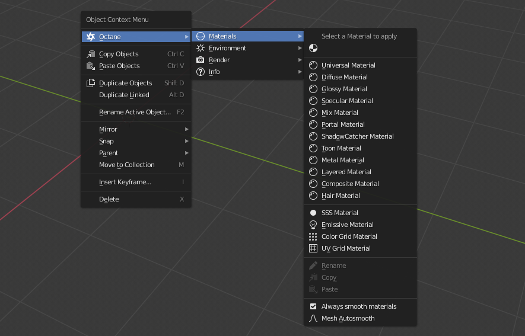

# OC-Blender-Helper-Addon
A helper addon for Octane Blender edition

> The reason I develop this addon is for speeding up user workflow, so users can access basic functions provided by Octane very quickly and newcomers can know where to start. The materials and nodes setup are pretty raw and treat it as a starting point

> I welcome issue reports, please let me know where to promote and fix

> Glhf

## Versions

* OctaneRender™ for Blender 2019 and later
* Current version **v2.1.0**
  * Tested on Blender_Octane_Edition_2020.1.RC3_21.5_beta (latest)

## Features

* You can find them by yourself

## Installation

* Preferences > Add-ons > Install
* Select Octane_Helper.zip to install
* Activate it

## How to use

* Pretty simple, just **Right Click** in the 3D viewport
* Make sure the Octane render is enabled, otherwise the menu will not show up
* It works in either object mode or edit mode, but provides different functions

## Issues

* We cannot insert keyframes and click file selector eyedropper from panels yet because of a known bug in Blender build, which will be fixed in future builds
* Free tire users are currently using 2019 builds which does not include a sphere light. So please do not click the Add Sphere Light button for now

## WIP

* Fire, Smoke materials
